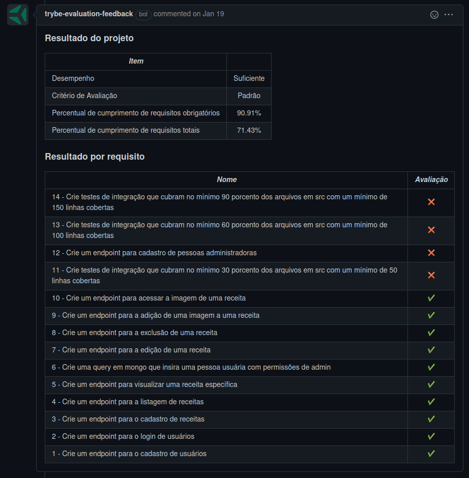

# Welcome to the Project Cookmaster

## Context

This project was made as a work assignment in during the Trybe web developer course.

The goal was to utilize all our learnings in mongoDB, and Mongo Aggregations, and create a RESTful API. It uses multer for image upload and return.

---

## How to install

For this project, you will need to have installed:
- NPM
- MongoDB

Copy the ssh from the project `git@github.com:luciobj/Project-Cookmaster.git`

* Open a terminal int your machine and type the following commands in order:

  * `git clone git@github.com:luciobj/Project-Cookmaster.git`
  * `cd Project-Cookmaster`
  * `npm install`

---

### Technologies

In this project the tecnologies used were NPM, MongoDB and MongoAggregations and Multer.

---

## Evaluator Results

This is a screenshot of the last run of the Trybe evaluator, which scores the demands of the project.

